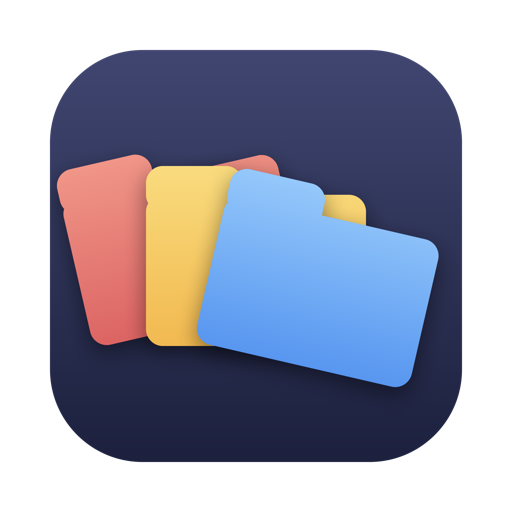
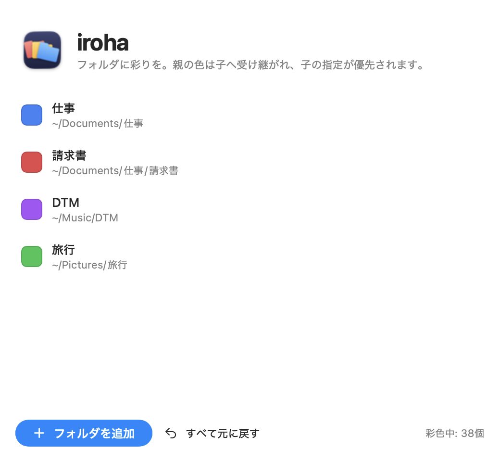

# iroha

<p align="center">
  
</p>

Finderのフォルダを色分けする macOS メニューバー常駐アプリ。
親フォルダに色を付けると、その中のフォルダすべてに同じ色が自動で受け継がれます。カラム表示や Mission Control でも「どのフォルダを開いているか」が色でひと目で分かります。

<p align="center">
  
</p>

## 特徴

- 🎨 **ほぼ無限の色** — macOS標準のカラーホイールから自由に選択（HEXカラー対応）
- 🪆 **継承ルール** — 親に付けた色は子孫フォルダへ自動適用。子に別の色を付けると、そこから下はその色が優先（CSSのカスケードと同じ「近い先祖が勝つ」方式）
- 👀 **常駐監視** — 新しく作ったフォルダにも数秒で自動着色。移動・改名にも追従し、色ゾーンの外に出たフォルダは色が自動で剥がれます
- 🔄 **完全に元へ戻せる** — 塗ったフォルダは台帳で全記録。ワンクリックで全解除
- 🛡️ **安全設計** — 元からカスタムアイコンが付いているフォルダは上書きしない／大量フォルダ・同期フォルダは登録時に警告
- 🔒 **完全ローカル** — ネットワーク通信は一切なし

## インストール

```bash
git clone https://github.com/aakisachi/iroha.git
cd iroha
./ビルド.sh
open /Applications/iroha.app
```

- 要件: macOS 13以降 / Swift 6以降（Xcodeは不要、Command Line Toolsで可）
- 署名にはお手元の Apple Development 証明書を自動検出して使います

## 使い方

1. メニューバーのパレットアイコン →「設定を開く…」（またはSpotlightで iroha をもう一度開く）
2. 「フォルダを追加」→ フォルダを選択 → カラーホイールで色を選ぶ
3. あとは自動。子フォルダにも色が付き、新規フォルダにも数秒で反映されます

やめたいときは「すべて元に戻す」でワンクリック復元できます。

## CLI（上級者向け）

```bash
/Applications/iroha.app/Contents/MacOS/FolderPainter add ~/Projects "#FF6600"
/Applications/iroha.app/Contents/MacOS/FolderPainter status
/Applications/iroha.app/Contents/MacOS/FolderPainter clear
```

※ 常駐アプリの起動中にCLIで設定を変えると競合します。常用は設定画面からどうぞ。

## 仕組み

- フォルダアイコンは macOS 標準の仕組み（`NSWorkspace.setIcon`）で着色。標準フォルダアイコンを Core Image で色相変換しています
- フォルダの変化は FSEvents で監視し、inode 追跡で移動・改名にも追従
- 塗ったフォルダには拡張属性の目印を書き込み、コピーで色が焼き付いた「迷子」も自動で正しい色に修復します

## 注意

- Dropbox / iCloud Drive などの共有フォルダに色を付けると、共有相手にも色付きアイコンが同期されることがあります（登録時に警告が出ます）
- フォルダアイコンの変更はフォルダ内に不可視ファイル（`Icon\r`）を作る macOS 標準の仕組みを使っています。Gitリポジトリ配下に使う場合は `.gitignore` に `Icon?` の追加をおすすめします

## ライセンス

MIT
